  

  
  
  
  
  

<b>MS Business Analytics &amp; AI @ Johns Hopkins</b> (Dean's Scholarship, 2026) &#183; moving to San Francisco Applied AI &#183; forward deployed &#183; founding engineer &#183; data science

---

## 01 / Latest

  

**Vibe Curator** is an AI native creative environment built on one refusal: generated media should not end as a flattened file. You describe a visual world, then keep shaping its image, motion, atmosphere, and music inside a persistent, source-aware editor.

**Why it matters:** most generative tools hand you an output and end the conversation. Here the scene graph stays editable, so a generation is a starting material rather than a final artifact.

**Proof:** four providers land in one scene model (OpenAI for source images, Anthropic for guarded shader effects, Gemini Veo for the video path, ElevenLabs for music). Model-written GLSL passes static guards *and* a real compile check before it can touch the live pipeline, so a bad generation cannot hang the GPU. Explore, Labs, and Player run different frame budgets over a shared Pixi/WebGL runtime and audio engine.

**Boundary:** a working prototype that prioritizes local use. Native packaging, cloud accounts, sync, and a real marketplace are unbuilt.

<i>TypeScript · Pixi · WebGL/GLSL · Anthropic · OpenAI · Gemini Veo · ElevenLabs</i>

<a href="https://github.com/shubhamjoshipromail-svg/vibe-curator">Source →</a> · <a href="https://portfolio-production-9040.up.railway.app/#vibe-curator">Case study →</a>

---

## 02 / Selected work

<table>
<tr>
<td width="50%" valign="top">

### ⚙️ Govern: AgentDock

A control plane where multi-agent Flows execute <b>real MCP tools</b> behind deny-by-default policy gates, approval workflows, and budget caps.

<b>Why it matters:</b> agents that act in the real world need governance, not vibes. An agent here can draft your email. Sending is <i>always</i> approval-gated.

<b>Proof:</b> permissions resolve and clamp on the server, so prompt text can request capability but never grant it. A durable Postgres job queue provides crash recovery, and idempotent external actions ensure a retried step never double-fires. 225 commits, 61 test files.

<i>TypeScript · Next.js · Prisma · Postgres + pgvector · official MCP SDK · Vitest</i>

<a href="https://www.youtube.com/watch?v=NdwP83VBurU">Watch the walkthrough →</a> · <a href="https://github.com/shubhamjoshipromail-svg/AgentDock">Source →</a>

</td>
<td width="50%" valign="top">

### 🎫 Route: OpsPilot

A support routing copilot where <b>redesigning the labels mattered more than another round of model tuning</b>.

<b>Why it matters:</b> the instinct is to reach for a bigger model. The data said the task definition was broken instead.

<b>Proof:</b> TF-IDF ~44%, CNN ~52%, ModernBERT on the original taxonomy ~52%. Collapsing 10 overlapping classes into 7 operational queues took it to <b>73.1%</b>. Confidence gating at 0.80 auto-routes 62.3% of tickets at 85.5% accuracy; the rest go to a human.

<i>PyTorch · ModernBERT · Hugging Face · leakage-safe splits</i>

<a href="https://huggingface.co/shubhamjoshipro/opspilot-routing-modernbert-base-clean-v1">Model →</a> · <a href="https://github.com/shubhamjoshipromail-svg/opspilot-ai/tree/codex/ticket-intelligence">Source →</a>

</td>
</tr>
<tr>
<td width="50%" valign="top">

### 📊 Decide: ACHP × CMS

Fragmented Medicare Advantage filings turned into decision grade evidence for a national healthcare organization.

<b>Why it matters:</b> the client needed to know whether a federal reimbursement cut was reaching consumers. Nobody had measured it.

<b>Proof:</b> a reproducible pipeline merged four CMS sources into a <b>138,263 × 208</b> master dataset; a 12× enrollment overcount was caught before it reached a model. OLS with HC3 robust errors quantified the cost shift, and ACHP held the stronger cost position in <b>493 of 875</b> counties. Top-3 team school-wide, presented to the client.

<i>Python · SQL · statsmodels · Tableau</i>

<a href="https://portfolio-production-9040.up.railway.app/#achp">Case study →</a>

</td>
<td width="50%" valign="top">

### 💊 Explain: RxCheck

A drug-interaction reviewer over <b>152,416 records</b>, built on one hard boundary: <b>the database decides; the model only explains.</b>

<b>Why it matters:</b> where an answer has to be defensible, an unverifiable one is worse than none. Detection is deterministic and the model is a bounded explanation layer.

<b>Proof:</b> a 26/26-scenario reproducible evaluation proves core checking completes even when every external service fails. RxNorm normalization, acknowledgment and override audit trails. A research prototype, and it says so.

<i>Python · FastAPI · SQLAlchemy · Postgres · React · Anthropic API</i>

<a href="https://pharmacy-production-f226.up.railway.app">Live demo →</a> · <a href="https://github.com/shubhamjoshipromail-svg/rxcheck">Source →</a>

</td>
</tr>
</table>

**Also built:** [Negotiator](https://github.com/shubhamjoshipromail-svg/hacknation_bluejays), an autonomous voice negotiation system with explicit deal policies · [FridgeChef](https://fride-project-production.up.railway.app), fridge and receipt scans into structured inventory and streamed recipes ([source](https://github.com/shubhamjoshipromail-svg/fridgechef)) · [Nimbus](https://nimbus-web-production.up.railway.app), a burnout companion with 9 grounded tools, built in 14 hours ([source](https://github.com/shubhamjoshipromail-svg/nimbus))

---

## 03 / How I build

1. **Deterministic systems decide; models explain.** RxCheck's detection core never asks an LLM whether an interaction exists.
2. **Humans keep the pen on consequential actions.** In AgentDock there is no grant configuration under which an outbound send auto-fires.
3. **Evaluation is part of the product.** OpsPilot's unstable DeBERTa runs were excluded rather than reported; RxCheck ships a 26-scenario eval you can rerun.
4. **The bottleneck is usually the data.** OpsPilot went ~52% → 73.1% by redesigning a noisy 10-label taxonomy, not by scaling the model.
5. **Generation needs a compiler, not just a prompt.** Vibe Curator gates every model-written shader through static analysis and a real compile pass before it renders.
6. **Say where the work stops.** Every project above carries an explicit boundary. That is the part most portfolios leave out.

---

## 04 / Tech, with receipts

| Layer | Tools | Where it's proven |
|---|---|---|
| AI systems | agents, MCP, RAG, tool calling, evals, guardrails | [AgentDock](https://github.com/shubhamjoshipromail-svg/AgentDock), [rxcheck](https://github.com/shubhamjoshipromail-svg/rxcheck) |
| Generative | multi-provider orchestration, guarded codegen, WebGL/GLSL, scene graphs | [vibe-curator](https://github.com/shubhamjoshipromail-svg/vibe-curator) |
| Modeling & NLP | PyTorch, ModernBERT fine-tuning, H2O AutoML, Optuna, SHAP/LIME | [opspilot-ai](https://github.com/shubhamjoshipromail-svg/opspilot-ai), [bank-marketing-ml](https://github.com/shubhamjoshipromail-svg/bank-marketing-ml) |
| Product engineering | TypeScript, Next.js/React, FastAPI, SSE streaming | [AgentDock](https://github.com/shubhamjoshipromail-svg/AgentDock), [fridgechef](https://github.com/shubhamjoshipromail-svg/fridgechef), [portfolio](https://github.com/shubhamjoshipromail-svg/portfolio) |
| Data | Python, SQL/Postgres, ETL & normalization, data quality | rxcheck's 152K-record import, the 138,263-row CMS master dataset |
| Delivery | Railway CI/CD, Docker, Prisma/SQLAlchemy, pytest/Vitest | every live link on this page |

---

## 05 / The deeper lab

<b>⚙️ Agent infrastructure &amp; governance</b>
 
AgentDock's execution layer: Postgres-backed job queue with lease/heartbeat crash recovery, idempotent external actions, step-cursor resume, SSE event streaming, per-user concurrency caps. Policy plane: deny-by-default grants with permission clamping (read_only &lt; draft_only &lt; approval_required &lt; blocked), Memory Firewall with scoped grants and audit logs, MCP revocation kill-switch. Integration tests run against a dedicated Postgres test database, including a tool-registration RCE security test and a red-team suite showing that prompt injection arriving through tool output cannot trigger an unapproved send.

<b>🎨 Generative systems &amp; guarded codegen</b>
 
Vibe Curator treats a model as an untrusted code author. Generated GLSL passes a static guard that rejects unbounded loops and other GPU-hanging constructs, then a real compilation pass; the compiler's line-numbered errors feed back to the model so retries converge instead of flailing. Each generation is recorded as a manifest with prompt, model, and lineage, which is what makes an effect remixable rather than one-shot. Source generation is deliberately separated from motion and sound so the scene stays editable, and Explore, Labs, and Player share one runtime while running different frame rate budgets.

<b>🎫 Applied NLP: the OpsPilot story</b>
 
Baselines first: TF-IDF + logistic regression ~44%, CNN ~52%, and ModernBERT on the original taxonomy ~52%. The results showed the labels were the problem. Redesigning 10 overlapping classes into 7 routing families (~24k leakage-safe examples, fixed splits) produced 73.1% accuracy and weighted-F1 0.713. Confidence gating at 0.80 auto-routes 62.3% of tickets at 85.5% accuracy; the rest escalate to humans. The model is deployed to <a href="https://huggingface.co/shubhamjoshipro/opspilot-routing-modernbert-base-clean-v1">Hugging Face</a> with weights, tokenizer, label mapping, and checkpoint history.

<b>📊 Analytics &amp; experiments</b>
 
CMS / ACHP capstone (top-3 team school-wide, presented to the client): merged four CMS datasets into a 138,263 × 208 master dataset, caught a 12× enrollment overcount created by mismatched geographic granularity, quantified cost-shift with OLS + HC3 robust SEs (premium ~+$2.8, MOOP ~+$97, p&lt;0.001), and found 67.5% of national plans eroded drug benefits versus 41.3% of ACHP plans. Delivered as Tableau dashboards and a client-facing market trends deck. Competitions: <a href="https://github.com/shubhamjoshipromail-svg/bank-marketing-ml">7th of 59 solo, ROC-AUC 0.8285</a> and <a href="https://github.com/shubhamjoshipromail-svg/property-automl-hackathon">MAE 8.708, 19th</a>. Plus an honest <a href="https://github.com/shubhamjoshipromail-svg/dating-agent-rl">tabular RL learning project</a>.

---

## 06 / Beyond the code

I co-founded and lead <b>BAAIO</b> (~100 members), the student AI organization at Johns Hopkins Carey. We run hands-on workshops, a buildathon, and <b>Brain Bank</b>, our recurring deep-dive on advanced AI × business. Before AI, I ran a web and marketing studio in Japan and taught adult professionals. I have lived and worked across Japan, Australia, and the United States, and speak English, Japanese, Nepali, and Hindi at native level.

Currently exploring: eval harnesses for agent systems, and what forward-deployed AI engineering should look like in regulated industries.

---

## 07 / Elsewhere

| | |
|---|---|
| **Portfolio** | [Case studies, evidence, and resumes](https://portfolio-production-9040.up.railway.app) |
| **YouTube** | [AgentDock walkthrough](https://www.youtube.com/watch?v=NdwP83VBurU) |
| **Hugging Face** | [Trained model artifacts](https://huggingface.co/shubhamjoshipro) |
| **LinkedIn** | [Technical writing and updates](https://www.linkedin.com/in/shubham-joshi1/) |

<i>Have a difficult problem and real ownership? <a href="mailto:shubhamjoshipro.mail@gmail.com">shubhamjoshipro.mail@gmail.com</a></i>

